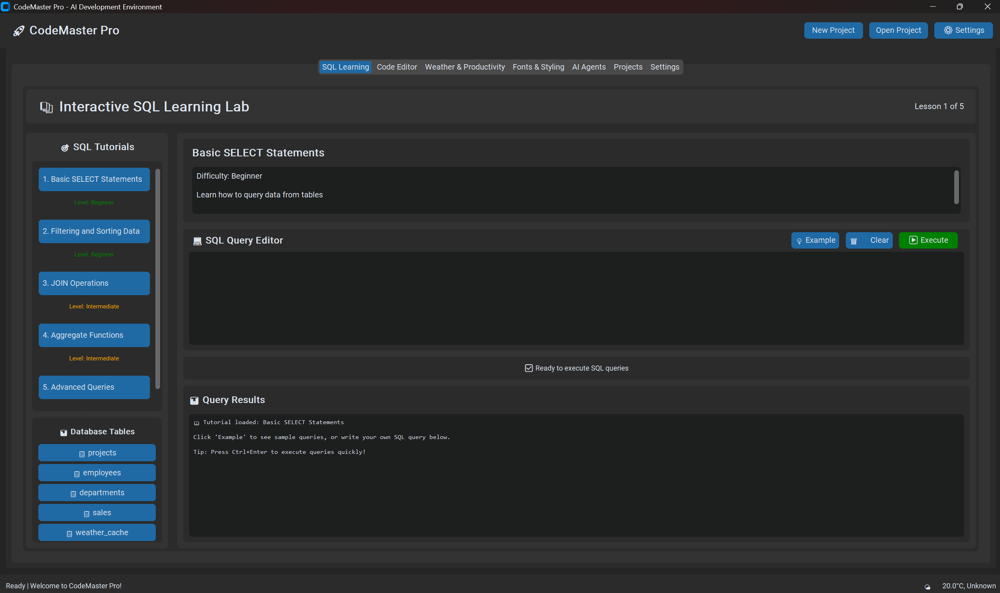

# CodeMaster Pro - AI-Powered Development Environment



*🎨 Modern, cross-platform development environment with SQL learning, weather integration, and AI assistance*

## 🚀 Overview
CodeMaster Pro is a comprehensive, cross-platform software development tool that combines AI agents, codebase management, weather integration, font styling, and SQL database functionality - all in one local application.

## ✨ **Live Demo**
The screenshot above shows CodeMaster Pro in action with:
- 📚 **Interactive SQL Tutorial** - Learn SQL with real-time query execution
- 🌤️ **Weather & Productivity** - Get coding recommendations based on weather
- 💻 **Code Editor** - AI-powered development assistance
- 🔤 **Font Manager** - Professional typography for optimal coding
- ⚙️ **Settings & Configuration** - Fully customizable environment

## 🎯 Features

### 1. **AI-Powered Codebase Management**
- Intelligent code analysis and suggestions
- Automated documentation generation
- Code quality assessment
- Git integration with AI assistance

### 2. **Integrated SQL Database & Learning System**
- Built-in SQLite database
- Interactive SQL tutorial system
- Query builder with visual interface
- Database schema designer

### 3. **Weather API Integration**
- Real-time weather data for development planning
- Location-based weather forecasting
- Integration with project scheduling

### 4. **Font & Styling APIs**
- Google Fonts integration
- Font preview and management
- Custom styling for code editors
- Theme management system

### 5. **Cross-Platform Compatibility**
- Windows 10+ support
- macOS compatibility
- Linux support
- Modern GUI with CustomTkinter

## 🛠️ Installation

1. **Clone the repository:**
```bash
git clone https://github.com/cravotics/CodeMaster_Pro.git
cd CodeMaster_Pro
```

2. **Install dependencies:**
```bash
pip install -r requirements.txt
```

3. **Set up environment variables:**
Create a `.env` file with your API keys:
```
OPENAI_API_KEY=your_openai_key_here
WEATHER_API_KEY=your_weather_api_key_here
ANTHROPIC_API_KEY=your_anthropic_key_here
GOOGLE_FONTS_API_KEY=your_google_fonts_key_here
```

4. **Run the application:**
```bash
python main.py
```

## 📚 Learning Path

This project is designed to teach you:

1. **Python GUI Development** with tkinter/CustomTkinter
2. **SQL Database Design** and operations
3. **API Integration** and HTTP requests
4. **AI Agent Implementation**
5. **Cross-platform Development**
6. **Git Integration** and version control
7. **Software Architecture** patterns

## 🏗️ Project Structure

```
CodeMaster Pro/
├── main.py              # Application entry point
├── gui/                 # GUI components
│   ├── main_window.py   # Main application window
│   ├── sql_tutor.py     # SQL learning interface
│   ├── code_editor.py   # Code editing interface
│   └── weather_widget.py # Weather display
├── database/            # Database management
│   ├── sql_engine.py    # SQL operations
│   ├── schema.py        # Database schema
│   └── tutorials.py     # SQL tutorials
├── ai_agents/           # AI functionality
│   ├── code_analyzer.py # Code analysis agent
│   ├── documentation.py # Doc generation agent
│   └── suggestions.py   # Code suggestions
├── apis/                # External API integrations
│   ├── weather_api.py   # Weather service
│   ├── fonts_api.py     # Font management
│   └── ai_services.py   # AI service connections
└── utils/               # Utility functions
    ├── git_manager.py   # Git operations
    ├── config.py        # Configuration management
    └── helpers.py       # Helper functions
```

## 🎓 SQL Learning Module

The integrated SQL tutorial covers:
- Basic SELECT statements
- JOIN operations
- Database design principles
- Advanced querying techniques
- Performance optimization
- Real-world examples

## 🔧 Configuration

Edit `config.py` to customize:
- AI model preferences
- Database settings
- API endpoints
- GUI themes
- Default project paths

## 🤝 Contributing

This project is designed for learning. Feel free to:
- Add new features
- Improve existing functionality
- Submit bug reports
- Share learning experiences

## 📖 Documentation

Detailed documentation is available in the `/docs` folder, including:
- API reference
- Architecture diagrams
- Code examples
- Best practices

## 🔐 Security

- All API keys are stored in environment variables
- Local database ensures data privacy
- No sensitive data transmitted to external services without consent

## 📞 Support

For questions or issues:
1. Check the built-in help system
2. Review the documentation
3. Submit an issue on the repository

---

**Built with ❤️ for developers who love to learn and build amazing things!**
